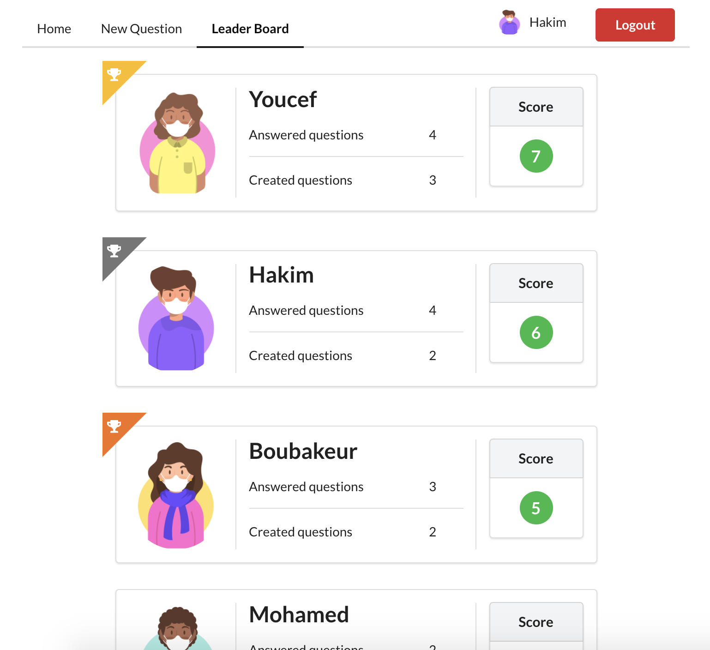
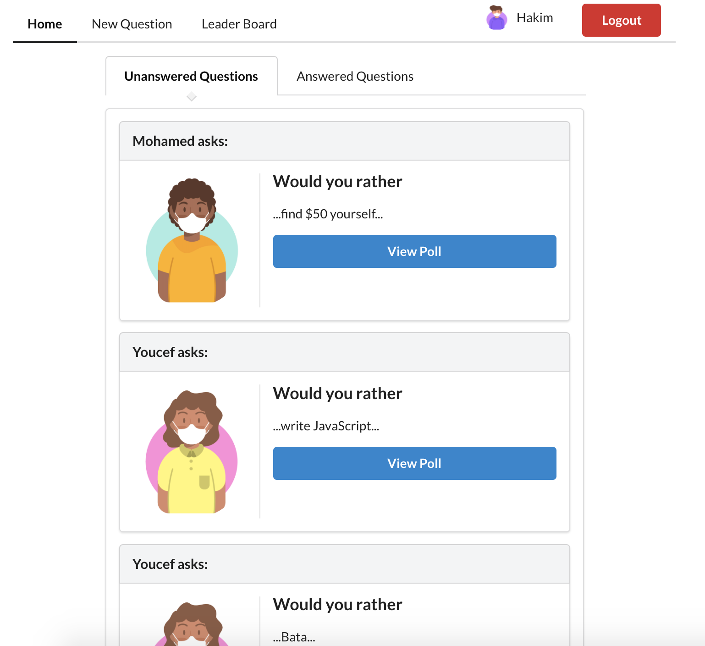

# Would You Rather

"Would You Rather?" is a React web app that lets a user play the “Would You Rather?” game. The game goes like this: A user is asked a question in the form: “Would you rather [option A] or [option B] ?”. Answering "neither" or "both" is against the rules.

In this app, users will be able to answer questions, see which questions they haven’t answered, see how other people have voted, post questions, and see the ranking of users on the leaderboard.




It uses React, Redux, React Router & Redux Thunk.

This app is the second of three projects required for [Udacity's React Nanodegree program](https://www.udacity.com/course/react-nanodegree--nd019).

-  [Live Demo](https://hakim-would-you-rather.netlify.app/)

## Installation

Clone the repository, change directories, and use npm or yarn to install the dependencies.
```bash
$ git clone git@github.com:HakimBenyoucef/reactnd-project-would-you-rather.git
$ cd reactnd-project-would-you-rather
$ yarn
```

## Usage

The project can be run with npm or yarn

- `yarn start`

The project can be viewed in the browser at

- http://localhost:3000
